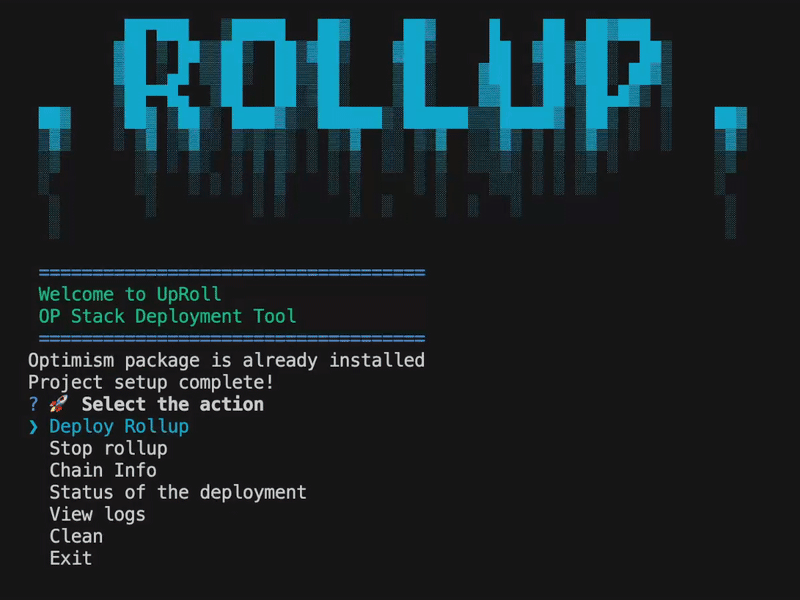
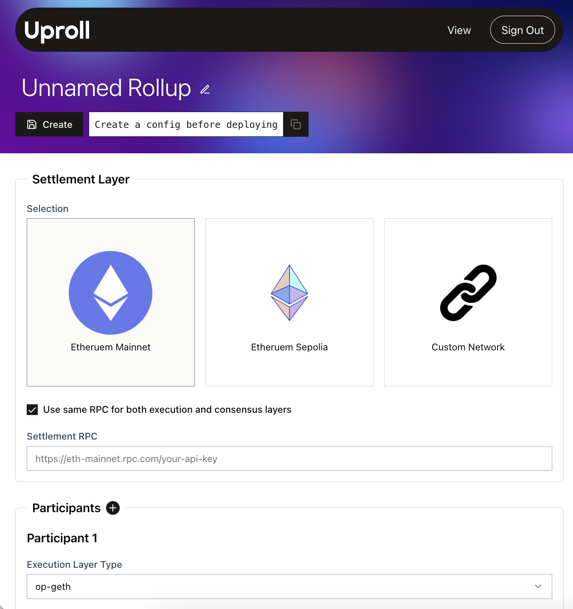
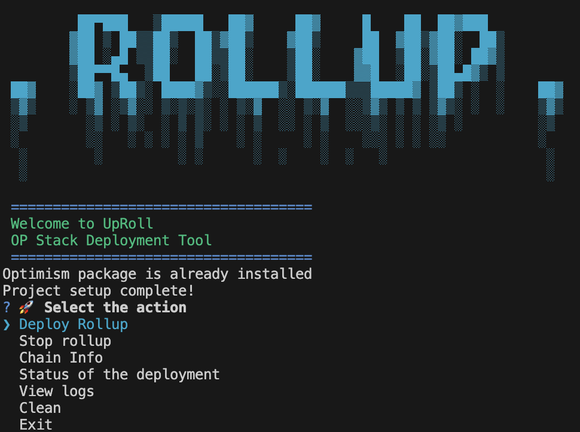
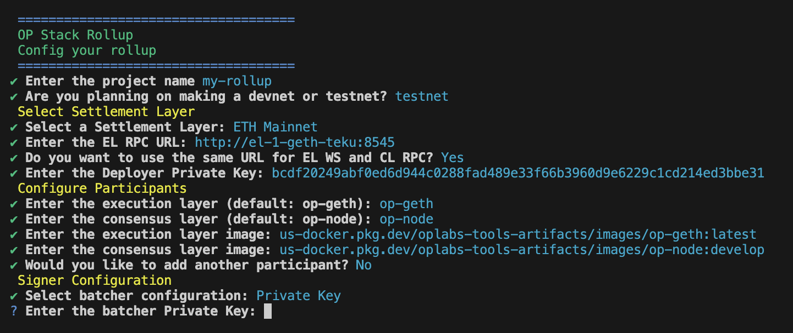
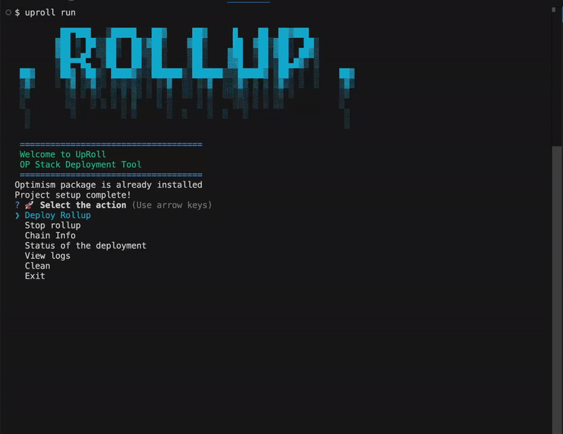
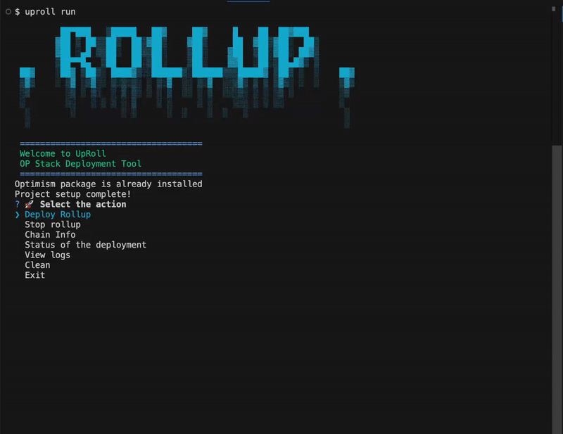
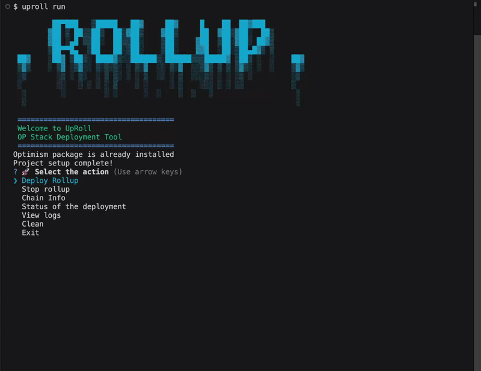
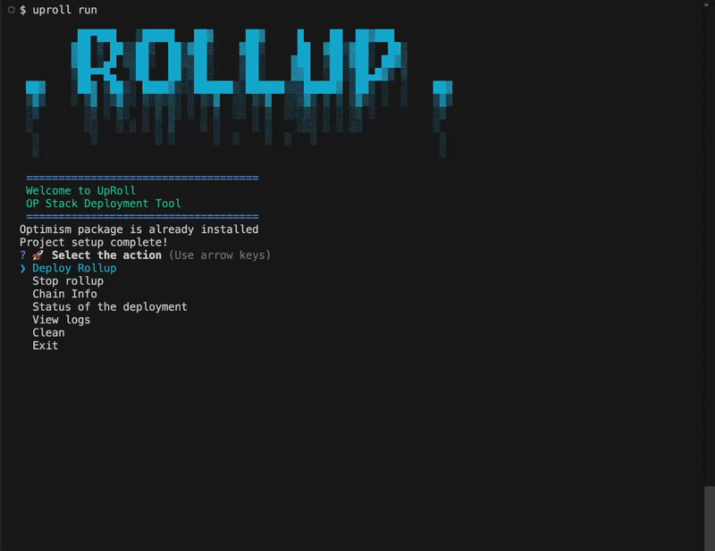

<p align="center">
    <picture>
      <source media="(prefers-color-scheme: dark)" srcset="https://upnode.org/static/746efe80b6fc0c3e8fe0326ce303ccfd/416c3/upnode.webp">
      
    </picture>
    <h1 align="center">UpRoll CLI Tool</h1>
    <h4 align="center">By Upnode</h4>
</p>

# UpRoll CLI Tool

<div style="text-align: center;">
    
</div>

The **UpRoll CLI Tool** by Upnode enables chain operators and developers to efficiently configure and deploy OP Stack chains. You can create a chain configuration either through our [website](https://uproll-web.vercel.app/) or directly via the CLI.


Deployment is handled through the CLI. After building your chain using the website, deployment is as easy as running:
 ```
 uproll deploy -i [config_id]
 ```


For deployment, UpRoll uses a fork of the [optimism package](https://github.com/zapper-95/optimism-package) which provides greater levels of customisation. Unlike Conduit, which is a paid, closed-source solution that relies on third-party managed servers, UpRoll CLI Tool is free, open-source, and allows developers to deploy OP Stack chains on their own infrastructure with full transparency.


## Requirements
To run the CLI, you will first need to make sure you have the following programs:

- [Node.js](https://nodejs.org/en/download) version 18 or higher and [Node package management](https://www.npmjs.com/)
- [Docker](https://docs.docker.com/get-started/get-docker/) version 27 or higher
- [Kurtosis](https://docs.kurtosis.com/install) latest version


**Install UpRoll CLI Tool**

```console
npm install -g @upnode/uproll-cli
```

**Verify version**

```console
uproll version
```

**Update version**

```console
npm update -g @upnode/uproll-cli
```


## Creating and Deploying a Chain

### Website + CLI

Our website allows you to create and store rollup configurations, which can then be used for deployment via the CLI.


#### 1. Create a Rollup Configuration
  1.  **Sign up** and navigate to the [Create Your Rollup](https://uproll-web.vercel.app/config) page
  2. Configure your chain settings and click **Save**
  3. Your configuration will be assigned a unique **configuration ID**

  

#### 2. Deploy Your Chain
To deploy your saved configuration, run:
```
uproll deploy -i [config_id]
```
Replace `config_id` with your chain's unique configuration ID.

You will then be prompted for the project name. Once entered, the chain configuration will be deployed.
### CLI Only
#### 1. Create a Rollup Configuration
Run the following command:
```
uproll run
```
Select **Deploy Rollup** from the menu.




You will then be prompted for values for various parameters. After confirming your selections, a valid configuration file will be generated automatically.




#### 2. Deploy your Chain
Deployment begins automatically once the configuration file is created. Alternatively, if you already have a configuration file, you can deploy it directly by running `uproll deploy -f [path/config.yaml]`


## Other Menu Options
All other menu options can be accessed by running:

```
uproll run
```


  


### Stop Rollup

This option stops a specific rollup from running and deletes its project folder. Since Kurtosis does not support restarting an enclave after stopping it, the rollup and its associated project folder are removed.


### Chain Info

After deployment, chain information is saved to a chain's project folder. 

The **Chain info** command retrieves files related to a rollup's deployment, such as `intent.toml` and `wallets.json` or its genesis file.





A list of active rollups is displayed. After selecting one, a list of available files appears. The chosen file is then displayed.

### Status of the deployment

This command displays the deployment status of a rollup, including each service.





### View logs

This command displays the log files of a particular rollup after it has been deployed.




### Clean

Kurtosis runs multiple Docker containers for each deployed chain, which can significantly impact your computer’s performance.

If you no longer need to run any chains, use the following command to stop and remove them.

**Note:** This will permanently delete their project folders, including all configuration files and logs.





## Layer 1 & Rollup Configuration Parameters

### **Wallet Configuration**
| Parameter | Description |
|-----------|-------------|
| **Enter the Deployer Private Key** | Private key of the contract deployer account |

### **Layer 1 Configuration**
| Parameter | Description |
|-----------|-------------|
| **Select Settlement Layer** | Choose between ETH Mainnet, ETH Sepolia, or a Custom Layer 1 |
| **Enter the Custom Chain ID (if applicable)** | Chain ID for custom Layer 1 setup |
| **Enter the EL RPC URL** | Execution Layer RPC URL |
| **Enter the EL WS URL** | Execution Layer WebSocket URL |
| **Enter the CL RPC URL** | Consensus Layer RPC URL |
| **Select RPC Kind for L1** | Determined automatically based on the RPC URL (Alchemy, QuickNode, or Standard) |

### **Signer Configuration**
| Parameter | Description |
|-----------|-------------|
| **Enter the Batcher Private Key or Signer Endpoint** | Choose between a private key or a signer endpoint for the batcher |
| **Enter the Sequencer Private Key or Signer Endpoint** | Choose between a private key or a signer endpoint for the sequencer |
| **Enter the Proposer Private Key or Signer Endpoint** | Choose between a private key or a signer endpoint for the proposer |
| **Enter the Challenger Private Key or Signer Endpoint** | Choose between a private key or a signer endpoint for the challenger |

We proivde a [signer-proxy](https://github.com/upnodedev/signer-proxy) tool which can sign be used as a signer endpoint to sign transactions for any of these roles.


### **Rollup Configuration**
| Parameter | Description |
|-----------|-------------|
| **Enter the L2 Chain ID** | Unique identifier for the Layer 2 chain |
| **Enter the L2 Block Time (in seconds)** | Time interval between Layer 2 blocks |
| **Enter the Withdrawal Delay (proofMaturityDelaySeconds)** | Time before withdrawals are finalised |
| **Enter the Dispute Game Finality Delay** | Time before dispute resolution is finalised |
| **Select the network for vault fee withdrawal** | Choose between L1 and L2 for withdrawal fees |

### **Gas Configuration**
| Parameter | Description |
|-----------|-------------|
| **Enter the Block Gas Limit** | Maximum gas allowed per block |
| **Enter the EIP 1559 Elasticity** | Elasticity multiplier for EIP-1559 fee model |
| **Enter the EIP 1559 Denominator** | Denominator for EIP-1559 fee model |
| **Enter the Base Fee Scalar** | Base fee multiplier |
| **Enter the Blob Base Fee Scalar** | Blob base fee multiplier |

### **Data Availability Configuration**
| Parameter | Description |
|-----------|-------------|
| **Select a Data Availability Type** | Options: auto, blobs, calldata, or custom |
| **Enter the Batcher Submission Frequency (minutes)** | Time interval between batch submissions |
| **Enter the DA Server Endpoint (if custom)** | URL of the Data Availability server |
| **Select a Commitment Type (if custom)** | Choose between Generic and KeccakCommitment |
| **Enter the DA Challenge Contract Address (if Generic)** | Address of the challenge contract |
| **Enter the DA Challenge Window** | Time window for challenges |
| **Enter the DA Resolve Window** | Time window for resolving disputes |
| **Enter the DA Bond Size** | Size of the bond for dispute resolution |
| **Enter the DA Refund Percentage** | Percentage of refund in case of dispute resolution |


## Getting Help
If you encounter any issues or have any suggestions for improvement, please open an issue on this repository.
